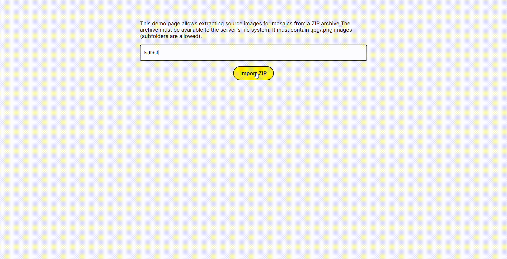

# F# Mosaic generator
F# and Next.js project to turn an input image into a mosaic consisting of many other pictures

## Project structure
1. ``Source\FSharpMosaicApi\`` - F# API, see [MosaicsController.fs](Source\FSharpMosaicApi\Controllers\MosaicsController.fs) for the endpoints declaration
    - ``POST /api/v1/mosaics`` - generates mosaic in highly parallel fashion
    - ``POST /api/v1/mosaics/import`` - adds images from a ZIP archive into the Sqlite DB to be used during generation. The progress is streamed back using [Server-sent events](https://developer.mozilla.org/en-US/docs/Web/API/Server-sent_events/Using_server-sent_events)
2. ``Source\fsharp-mosaic-client\`` - Next.js client web app. The following pages are available
    - ``/`` - mosaic generation page
    
    - ``/import-zip`` - demo page for importing ZIP archive of images
    

## How to run
1. Clone this repo into a directory with write permissions (a Sqlite DB and pre-processed images will be saved in it)
2. Run API using Visual Studio (make sure to install "F# dekstop language support" component and .NET 8)
3. Run client (Node 22+ and ``yarn`` must be installed beforehand)
```ps
cd Source\fsharp-mosaic-client\
yarn
yarn start
```
4. Open the client in your browser at [http://localhost:3000/](http://localhost:3000/)